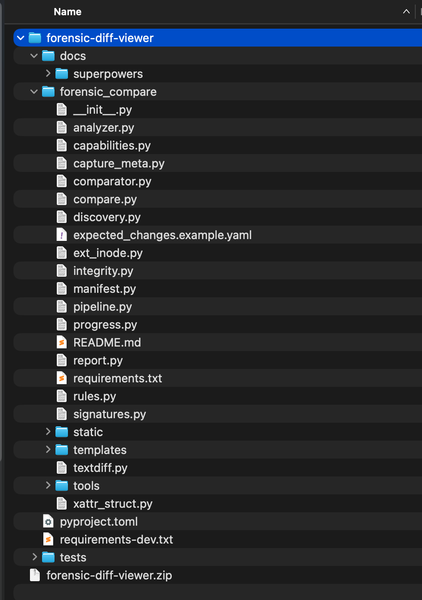
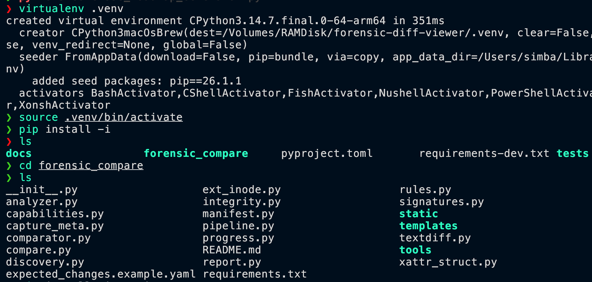
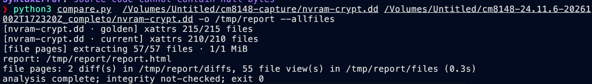
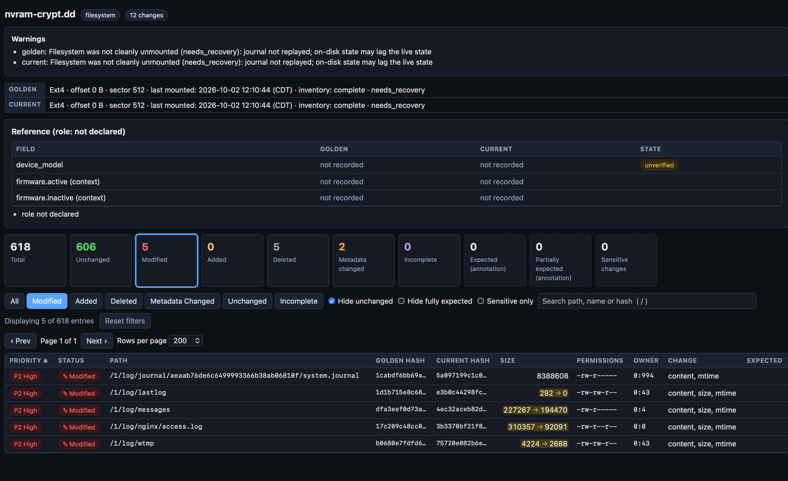

# Forensic Diff Viewer

Quick setup and usage guide for comparing forensic filesystem images on macOS or Linux.

## Project Structure



## 1. Extract the Project

Extract the `forensic-diff-viewer.zip` archive and open a terminal in the extracted project directory.

## 2. Create a Python Virtual Environment

```bash
virtualenv .venv
source .venv/bin/activate
```

## 3. Enter the Application Directory

```bash
cd forensic_compare
```

## 4. Install Python Dependencies

```bash
pip install -r requirements.txt
```



## 5. Install Required Forensic Tools on macOS

```bash
brew install sleuthkit e2fsprogs
```

On Apple Silicon Macs, add `e2fsprogs` to your `PATH`:

```bash
echo 'export PATH="$PATH:/opt/homebrew/opt/e2fsprogs/sbin:/opt/homebrew/opt/e2fsprogs/bin"' >> ~/.zshrc
source ~/.zshrc
```

## 6. Verify Required Commands

Run these checks on macOS or Linux:

```bash
which fls
which debugfs
which fsstat
which icat
```

Each command should return a valid executable path.

## 7. Run a Comparison

General syntax:

```bash
python3 compare.py File1 File2 -o /destination_report --allfiles
```

Example:

```bash
python3 compare.py /Volumes/Untitled/cm8148-capture/nvram-crypt.dd /Volumes/Untitled/cm8148-24.11.6-20261002T172320Z_completo/nvram-crypt.dd -o /tmp/report --allfiles
```



## 8. Open the Generated Report

On macOS:

```bash
open /tmp/report/report.html
```

You can also open the output folder manually and open `report.html` in a browser.



## Report Contents

The generated report can show:

- Total, unchanged, modified, added, deleted, metadata-changed, and incomplete entries
- Golden and current file hashes
- File size, permissions, ownership, and detected changes
- Filtering for modified, added, deleted, metadata-changed, and unchanged files
- Individual file views and text diffs when available

## Included Files

```text
forensic-diff-viewer-github/
├── README.md
├── forensic_diff_viewer_guide.html
└── images/
    ├── project-structure.png
    ├── virtualenv-setup.png
    ├── comparison-run.png
    └── report-example.png
```
